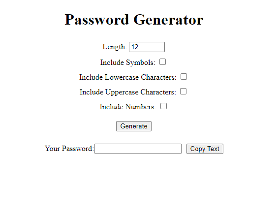

# Password-Generator

- Ability to generate a password of any length (minimum 6 characters)  
- Ability to decide if you want uppercase, lowercase, numbers, symbols  
- Output in a friendly input field so it can easily be edited/tweaked  
- Click to Copy ability

See a working copy 

Practice JavaScript

- Select fields to get user selected options
- Work with functional programming
- A basic object

